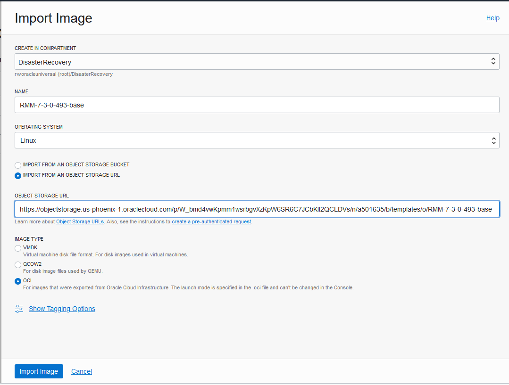
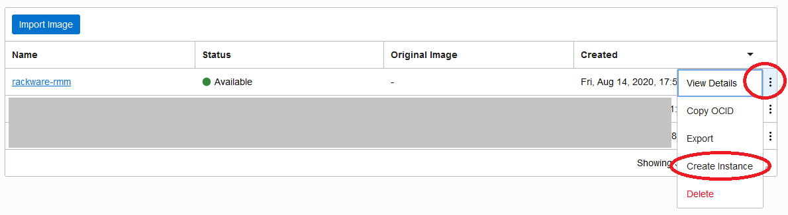

# DR-Rackware
## Step 1: Import RMM Image from Rackware
1.	Log in to your OCI account
2.	Open the navigation menu. Under Core Infrastructure, go to Compute
3.	Select your target region
4.	Select your target compartment
5.	Click Custom Images.
6.	Click Import Image.

In the Create in Compartment list, select the compartment that you want to import the image to.   This should be the same compartment as the one that will contain the instances of the migrated servers. 

7.	Enter a Name for the image.\
    a.	rackware-rmm
8.	Select  Linux for the Operating System:
9.	Select “Import from an Object Storage URL”, then cut/paste the following into the Object Storage URL field\
    a.	https://objectstorage.us-phoenix-1.oraclecloud.com/p/W_bmd4vwKpmm1wsrbgvXzKpW6SR6C7JCbKII2QCLDVs/n/a501635/b/templates/o/RMM-7-3-0-493-base
10.	In the Image Type section, select the format of the image.\
    a.	OCI
    
    
11.	Click Import Image.  

After you click Import Image the imported image will show in the Custom Images list for the compartment, with a status of IMPORTING. To track the progress of the operation, you can monitor the associated work request.  For more information, see Using the Console to View Work Requests.  

When the import completes successfully, the status changes to AVAILABLE. This will take several minutes.    If the status does not change, or no entry appears in the Custom Images list, the import failed. If the import failed, ensure you have read access to the Object Storage object.rac

## Step 2: Create RMM instance from the Imported Image
Now we will need to create an instance from this custom image and modify the instance.    
1.	On the Custom Images screen, click on the three dots in the row of rackware-rmm and select ‘Create Instance’
 
Enter the name you wish to call the instance, e.g. “RMM”.   Give the instance a shape appropriate for your deployment.   
2.   In the ‘Add SSH Keys’ either upload your ssh key to connect to the instance after it is created or paste the key contents
 

