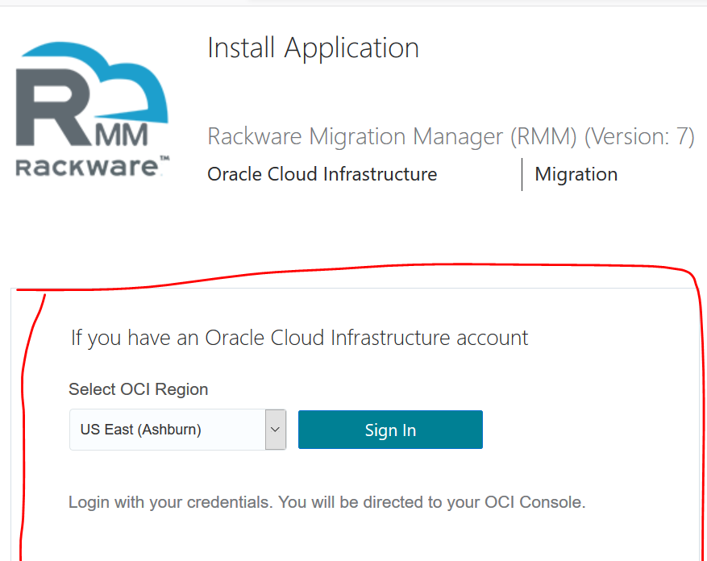

# DR Rackware Deployment

## Introduction
Welcome to this workshop where we will deploy the RackWare Migration Manager (RMM) on OCI as a Disaster Recovery solution.

### Objectives
- Deploy and configure RMM on OCI
- Replicate APEX instances from source machines to autoprovision backup instances
- Perform a failover operation to simulate a DR scenario

## Step 1: Create an APEX Workspace & Sample Application in the source instance
1. Navigate to the APEX instance through a web browser i.e https://<public-ip>:8888/ords/<database-conection> and select **Administration Services** from the bottom of the page.

2. Login using the username *admin* and the database admin password. If prompted, reset the password upon login. Once logged in select **Create Workspace**

3. Give the workspace a name (e.g "DEV") and click Next.
4. Add the following settings on the "Identify Schema" page:
    - **Re-use existing schema?:** No
    - **Schema Name:** (Choose any name e.g "DEV")
    - **Schema Password:** (Choose a password that conforms to the database password constraints)
    - **Space Quota (MB):** 100
5. Add the following settings on the "Identify Administrator" page:
    - **Administrator Username:** (Choose a username e.g. "admin")
    - **Administrator password:** (Choose a password that conforms to the database password constraints)
    - First Name:
    - Last Name:
    - **Email:** (Enter a valid email)
6. Click **Create Workspace** on the confirmation page.
7. Once the workspace is create log out of the **Administration Services**

8. Enter the workspace name created in step 3 and fill in the admin login created in step 5. Click  **Sign In**

9. On the landing page, select **App Gallery**

10. Select the **Sample Database Application** and click **Install App**

11. Once installed, click the green play button to run the App.

12. Log in using the same admin credentials created in step 5.

    
    
## Step 2: Import RMM Image from Rackware
1.	Navigate to <a href="https://cloudmarketplace.oracle.com/marketplace/en_US/homePage.jspx" target="_blank">Oracle Marketplace</a>
2.	Search "RackWare" and select the "RackWare Migration Manager (RMM)"

3.	Click "Get App" and sign into your OCI Console

4.	Launch the instance in the target compartment (This should be the same compartment as the one that will contain the instances of the migrated servers.)

5.	Enter a Name for the instance.\
    a.	dr_rackware_rmm
6.	Give the instance a shape appropriate for your deployment.
7.   In the ‘Add SSH Keys’ either upload your ssh key to connect to the instance after it is created or paste the key contents
    

## Step 3: Configure Rackware Components
Use the following **[guide](https://www.rackwareinc.com/rackware-rmm-oracle-marketplace-dr-march-2020)** to complete the Rackware deployment configuration. (Use the passthrough method)

## Step 4: Connect the new instance to the Backup database
1. Start an ssh connection to the newly created instance.
2. Navigate to the root compartment and edit the *defaults.xml* file
```
opc@<target-machine>$ sudo su -
root@<target-machine>$ vi /home/oracle/conf/ords/defaults.xml
```
3. Change the db.hostname entry to relfect the IP of the backup database


4. Update the db.hostname in *ords_params.properties* file to reflect the IP of the backup database
```
root@<target-machine>$ vi /home/oracle/params/ords_params.properties
```

5. Start the ORDS server on the target machine
```
root@<target-machine>$ sudo su - oracle
oracle@<target-machine>$ ./start_ords.sh
```

## Step 5: Conduct the failover operation to activate the backup database

1. Navigate to the standby database

2. Click the database name under the backup DB System

3. Under **Resources** on the left, choose Data Guard Associations. Click the three dots on the right and select **Failover**

4. Enter the database password and click OK. The failover operation will take a few minutes to complete.

5. Navigate back to the StandbyDatabase DB system and look at the Peer Role under Data Guard Associations. It shows Disabled Standby which also reaffirms that the failover was successful.


## Step 6: 
